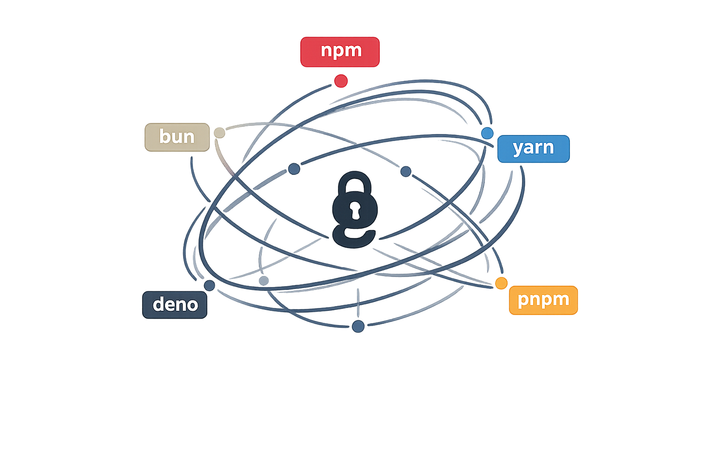

# lockgraph

> Universal lockfile model and converter for **npm**, **yarn**, **pnpm**, **bun**, **deno** with reasonable losses.

<p>

Each package manager brings its own philosophy of how to describe, store and
control project dependencies. Inside a single repo it stays invisible.
Across an organisation it becomes a recurring cost — security tooling that speaks
one format, migrations that stall, policy that cannot be applied uniformly.

Underneath every one of them is the same dependency graph. lockgraph models that
graph independently of any manager, then projects it back into the format you
need. Conversion is the obvious use case. Modification — audit-fix, override
pinning, license filtering — is the primary one.

</p>

## tl;dr

<!-- readme-example id="tldr-pnpm-to-npm" mode="fixture:simple-pnpm-v9-to-npm3" -->
```ts
import { readFile, writeFile } from 'node:fs/promises'
import { parse, stringify } from 'lockgraph'

const graph = parse(await readFile('pnpm-lock.yaml', 'utf8'))
await writeFile('package-lock.json', stringify(graph, 'npm-3'))
```

| Format | ids |
|---|---|
| npm | `npm-1` `npm-2` `npm-3` `npm-4` |
| yarn | `yarn-classic`, `yarn-berry-v4` … `yarn-berry-v10` |
| pnpm | `pnpm-v5` `pnpm-v6` `pnpm-v9` |
| bun | `bun-text` |
| deno | `deno-v2` `deno-v3` `deno-v4` `deno-v5` |

All of them detect, parse and stringify. Conversion is defined for every ordered
pair; where a pair is unsupported, the contract states which evidence is missing
rather than only failing. [API.md](./docs/arch/API.md) ·
[SCHEMAS.md](./docs/arch/SCHEMAS.md) · [CONVERT.md](./docs/arch/CONVERT.md)

## Concept

A target lockfile is **constructed** from whatever sources are available: the input
bytes, project manifests, the manager's cache, and — opt-in — the registry.
Conversion is the simple case; construction is the general one.

### Model

Three layers, never collapsed:

- **Manifest** — declared constraints from `package.json`.
- **Graph** — resolved package instances, peer-aware, and the edges between them.
  The canonical model. Modifiers operate here.
- **Layout** — the physical projection on disk: hoisted, isolated, PnP, nm-linked.

Conversion is lossy by design: the goal is *semantically equivalent*, not
*byte-identical*.

### Trusted output

**Verified by the package manager, not by our tests.** Each supported conversion is
checked by running the pinned binary — `npm ci`, `yarn --immutable`,
`pnpm --frozen-lockfile`, `deno install --frozen` — over the lockfile we produce.
If the manager rewrites that file, we do not claim the conversion.

**Irreducible facts are not negotiable.** Integrity hashes, resolution URLs and
signatures survive the projection or it throws instead of emitting a plausible file.
Losses are declared, named, and carry a remedy where one exists. `strict: false`
opts out.

**Behaviour is derived from research.** The format, package-manager and registry
specifications are built from official documentation together with producer source,
then checked against real artifacts.

### PM compose

The obvious way to generalise is to bundle the managers — every family, every major
version — and dispatch to whichever one a repository uses, the way
[Renovate](https://github.com/renovatebot/renovate) and
[Dependabot](https://github.com/dependabot/dependabot-core) run one helper per
manager.

We deliberately do not.

**Policy.** A cooling-off window on fresh releases, a trust rule, a license bar —
every manager supports its own subset, under its own name. Here it is a single
acceptance gate over the graph, identical no matter which one wrote the file.

**Predictability.** The usual chain is a direct edit repaired by a side effect —
inject, then `yarn --update-checksums`. It is fragile and non-deterministic: our own
[specification](./docs/spec/pm/yarn.md) could not pin how that flag and legacy
checksums interact. A change here is stated, and the output follows from it alone.

**Granularity.** Subgraphs move independently, each under its own rule — retarget a
transitive five levels down, pin an override in a neighbouring branch, and neither
disturbs anything else.

In exchange, correctness stops being free. A manager that runs is right by
construction; we have to prove it — and we bundle none.

## Install

```shell
npm i lockgraph
```

Node ≥ 14.18, ESM only. CommonJS consumers use `await import('lockgraph')`.

## Use

### Convert a lockfile

<!-- readme-example id="convert" mode="fixture:pnpm-v9-to-npm3" -->
```ts
import { readFile, writeFile } from 'node:fs/promises'
import { convert } from 'lockgraph'

const lock = await convert(await readFile('pnpm-lock.yaml', 'utf8'), { target: 'npm-3' })
await writeFile('package-lock.json', lock)
```

It converts, so it returns the bytes. This pair needs nothing but the lock; most need
more, and say which rather than guessing. An unmet target throws `LockfileError`
carrying the whole diagnostic record, so only non-fatal findings are worth observing:

<!-- readme-example id="convert-diagnostics" mode="fixture:yarn-berry-v9-in-place" -->
```ts
import { readFile } from 'node:fs/promises'
import { convert } from 'lockgraph'

await convert(await readFile('yarn.lock', 'utf8'), {
  target: 'npm-3',
  strict: false,                                   // best effort instead of throwing
  onDiagnostic: (d) => console.warn(d.code, d.subject),
})
```

### Look before you leap

<!-- readme-example id="inspect" mode="fixture:pnpm-v9-in-place" -->
```ts
import { readFile } from 'node:fs/promises'
import { detect, parse } from 'lockgraph'

const raw = await readFile('pnpm-lock.yaml', 'utf8')
detect(raw)                       // 'pnpm-v9'

const graph = parse(raw)          // format detected
graph.roots()                     // the workspaces
graph.byName('lodash')            // every lodash node id
graph.overrides()                 // what the lock pins
graph.diagnostics()               // what parsing found
```

Subject first, format after, as in `JSON.parse`. `stringify` needs the format, since a
graph does not imply a target.

Both are synchronous and never touch the network — but they read more than the bytes:
parsing needs workspace and override material, emitting needs policy and strictness.
Those go in the trailing options bag.

### The three steps, apart

`convert` is `parse` + `enrich` + `stringify`. Take them apart when you want the graph
in between: to inspect it, to modify it, or to emit one graph to two targets without
paying for evidence twice.

<!-- readme-example id="convert-and-enrich" mode="typecheck" -->
```ts
import { readFile, writeFile } from 'node:fs/promises'
import { enrich, parse, stringify } from 'lockgraph'

const graph = parse(await readFile('yarn.lock', 'utf8'))

const { graph: ready } = await enrich(graph, {
  target: 'yarn-berry-v10',
  cwd: process.cwd(),
  sources: { artifacts: ['yarn-berry:.yarn/cache', 'npm'] },
})

await writeFile('yarn.lock', stringify(ready, 'yarn-berry-v10'))
await writeFile('yarn-v8.lock', stringify(ready, 'yarn-berry-v8'))
```

`contract` governs what the result *claims*, not how hard enrichment works: at the
default `'snapshot'` it still fills whatever the target format requires.

### When bytes are not enough

For example, Yarn Berry v10 checksums are not the v8 ones. They have to be recomputed
from the archives, so `parse` and `stringify` cannot reach that target — and the pair
says so with `ENRICH_REQUIRED` instead of emitting a lock Yarn would rewrite.

<!-- readme-example id="convert-with-caches" mode="typecheck" -->
```ts
import { readFile } from 'node:fs/promises'
import { convert } from 'lockgraph'

await convert(await readFile('yarn.lock', 'utf8'), {
  target: 'yarn-berry-v10',
  cwd: process.cwd(),
  sources: { artifacts: ['yarn-berry:.yarn/cache', 'npm'] },
})
```

Order is your preference, left to right. You say where your caches are; which of them
supplies bytes and which supplies checksums is ours to work out.

### Where the bytes come from

<!-- readme-example id="artifact-sources" mode="typecheck" -->
```ts
import { readFile, writeFile } from 'node:fs/promises'
import { enrich, liveRegistry, parse, stringify } from 'lockgraph'

const target = 'yarn-berry-v10'
const graph = parse(await readFile('yarn.lock', 'utf8'))

const artifacts = [
  'yarn-berry:./.yarn/cache',       // families: npm and yarn-berry only —
  'npm:./.cache/npm/_cacache',      // pnpm's decomposed store keeps no archive,
                                    // so it fails closed instead of contributing nothing
  liveRegistry({                    // the only byte-capable source; omit it and
    cwd: process.cwd(),             // the operation is visibly offline
    config: 'yarn-berry',           // which config grammar to read, not the target
  }),                               // last: local caches are tried before the network
]

const ready = await enrich(graph, {
  sources: { artifacts },
  target,
  contract: 'install',              // 'snapshot' — the bytes, projected
                                    // 'policy'   — + declared policy satisfied
                                    // 'install'  — + everything an install needs
})
await writeFile('yarn.lock', stringify(ready.graph, target))
```

`install` is the top rung, and it is still a claim about the lock's contents, not about
the manager's behaviour: whether the manager rewrites the file is settled by running
it — [Proving it installs](#proving-it-installs).

Bytes are checked against lock-recorded integrity before any checksum is recomputed,
wherever they came from. That check is not overridable. Resource ceilings are:

#### Ceilings you already have

<!-- readme-example id="guards" mode="typecheck" -->
```ts
import { readFile } from 'node:fs/promises'
import { convert } from 'lockgraph'

await convert(await readFile('package-lock.json', 'utf8'), {
  target: 'pnpm-v9',
  guards: [
    { patterns: ['typescript@5.9.2'], artifactCompressed: '512 MiB' },
    { artifactCompressed: '128 MiB', artifactInflated: '1 GiB', networkTraffic: '2 GiB' },
  ],
})
```

[Defaults](./docs/arch/API.md#guards) apply as a trivial safeguard; `guards` overrides
them. A ceiling can abort an operation and never weakens verification: tripping one
ends that acquisition with a named diagnostic rather than returning unchecked bytes.

#### A cold machine

<!-- readme-example id="store" mode="typecheck" -->
```ts
import { readFile } from 'node:fs/promises'
import { convert, lockgraphStore } from 'lockgraph'

const lockfile = await readFile('package-lock.json', 'utf8')
const target = { format: 'yarn-berry-v8', cacheKey: '10c0' } as const

// Default: the global store is consulted first, then the ordered sources.
// It lives under $XDG_CACHE_HOME/lockgraph, holds 5 GiB, evicts deterministically.
await convert(lockfile, { target, sources: { artifacts: ['npm'] } })

// `false` disables reads and writes alike — a build that touches no shared cache.
await convert(lockfile, { target, store: false, sources: { artifacts: ['npm'] } })

// A store this operation owns — a CI cache directory, capped.
await convert(lockfile, {
  target,
  store: lockgraphStore('./.cache/lockgraph', { maxBytes: '2 GiB' }),
  sources: { artifacts: ['npm'] },
})
```

A hit is never trusted for being a hit: it is re-verified against the current
lockfile's digests before use, so deleting the store changes how long an operation
takes and nothing about what it produces. Layout, permissions, pinning and eviction
are in [API.md](./docs/arch/API.md).

### Settling the graph after a change

<!-- readme-example id="audit-fix" mode="typecheck" -->
```ts
import { readFile, writeFile } from 'node:fs/promises'
import { complete, modify, parse, stringify } from 'lockgraph'

const target = 'npm-3'
const graph = parse(await readFile('package-lock.json', 'utf8'))

const bumped = await modify(graph, [
  { kind: 'replaceVersion', selector: { name: 'lodash' }, to: '4.17.21' },
  { kind: 'pinOverride', name: 'minimist', to: '1.2.8' },
], { target })

const settled = await complete(bumped.graph, {
  target,
  seed: bumped.frontier,   // what this change added and orphaned — nothing else
  pruneOrphans: true,      // retire what it stranded
})

await writeFile('package-lock.json', stringify(settled.graph, target))
```

A bump is the same edit whichever manager produced the lock. The `frontier` is what
keeps the second pass bounded to the change instead of re-deriving the whole graph.

With no change to settle, sweep by reachability instead:

<!-- readme-example id="graph-sweeps" mode="fixture:pnpm-v9-swept" -->
```ts
import { readFile, writeFile } from 'node:fs/promises'
import { parse, removeUnreachable, stringify } from 'lockgraph'

const graph = parse(await readFile('pnpm-lock.yaml', 'utf8'))

const swept = removeUnreachable(graph)   // sync, deterministic, idempotent; refuses a
console.log(swept.removed)               // graph with no workspace anchor rather than
                                         // cascade-wiping it

// The sweep drops adapter state the emit is strict about, so the loss is declared.
await writeFile('pnpm-lock.yaml', stringify(swept.graph, 'pnpm-v9', { strict: false }))
```

### A whole project, not just its lockfile

<!-- readme-example id="project" mode="typecheck" -->
```ts
import { writeFile } from 'node:fs/promises'
import { convert } from 'lockgraph'

const { lockfile, companions } = await convert(
  ['package.json', 'packages/*/package.json', 'pnpm-lock.yaml'],
  //  ^ paths or globs; a { path: content } map instead operates on a synthetic
  //    project and never touches the filesystem. Coverage is derived from the
  //    root manifest — you cannot overstate it, and a gap is a diagnostic.
  { target: 'yarn-berry-v8', contract: 'install' },
)

await writeFile('yarn.lock', lockfile)
for (const file of companions) await writeFile(file.path, file.content)
//   ^ the files that must change with the lock. Which ones depends on the pair,
//     so the list is computed; skip them and the target manager rejects the lock.
```

### Reaching the network, or refusing to

<!-- readme-example id="registry" mode="typecheck" -->
```ts
import { readFile } from 'node:fs/promises'
import { defaultFetch, enrich, frozenRegistry, liveRegistry, parse } from 'lockgraph'
import type { Limiter } from 'lockgraph'

const graph = parse(await readFile('package-lock.json', 'utf8'))

// Retries are a fetch wrapping the default one — nothing to register.
const retrying: typeof fetch = async (input, init) => {
  for (let attempt = 1; ; attempt += 1) {
    const response = await defaultFetch(input, init)
    if (attempt === 3) return response
    if (response.status !== 429 && response.status < 500) return response
    const after = Number(response.headers.get('retry-after')) * 1000
    await new Promise((wake) => setTimeout(wake, after || 2 ** attempt * 100))
  }
}

// A pool is any function that gates how many tasks run at once.
const pool = (size: number): Limiter => {
  const running = new Set<Promise<unknown>>()
  return async (task) => {
    while (running.size >= size) await Promise.race(running)
    const started = task()
    running.add(started)
    return started.finally(() => running.delete(started))
  }
}

const live = liveRegistry({
  cwd: process.cwd(),
  config: 'npm',        // the resolution flow to walk, not the conversion target
  fetch: retrying,      // your transport
  limit: pool(8),       // your concurrency
})

const offline = frozenRegistry(graph)   // answers only from what the graph records

await enrich(graph, {
  target: 'pnpm-v9',
  sources: { packuments: [offline, live], artifacts: [live] },
})
```

**`config` says whose configuration to read — not what to emit.** `'npm'` walks
`.npmrc` from `cwd` upward, then the user and global files, then `NPM_CONFIG_*`, and
from that knows, per package, which registry serves it — `@scope:registry` included —
and which credential that host takes. `'pnpm'`, `'yarn-classic'` and `'yarn-berry'`
walk their own.

So an npm shop emitting a Yarn lock still writes `config: 'npm'`: that is where its
tokens are. Two ways to answer:

<!-- readme-example id="registry-config" mode="typecheck" -->
```ts
import { liveRegistry } from 'lockgraph'

const PRIVATE = 'https://npm.acme.dev/'
const PUBLIC = 'https://registry.npmjs.org/'

// Either — walk that package manager's own configuration flow from disk.
const discovered = liveRegistry({ cwd: process.cwd(), config: 'npm' })

// Or — answer them yourself. Nothing is read, nothing is discovered.
const declared = liveRegistry({
  config: {
    registryFor: (name) => (name.startsWith('@acme/') ? PRIVATE : PUBLIC),
    // Asked about a registry root, never an arbitrary URL.
    authHeaderFor: (root) =>
      root === PRIVATE ? `Bearer ${process.env.ACME_TOKEN}` : undefined,
  },
})
```

The object form suits a container, a test, or a service holding its own credentials.
Either way the adapter confines what it is given to that route and revalidates every
request and redirect hop, so a token cannot leak to another origin — that binding is
the library's job, not yours.

Only re-resolution, checksum refill and advisory audit need a registry at all.

### Proving it installs

<!-- readme-example id="frozen" mode="typecheck" -->
```ts
import { execFile } from 'node:child_process'
import { writeFile } from 'node:fs/promises'
import { promisify } from 'node:util'
import { certifyFrozen, prepareFrozen } from 'lockgraph'

const run = promisify(execFile)
const cwd = process.cwd()
const { stdout } = await run('npm', ['--version'], { cwd })
const version = stdout.trim()               // the oracle names its own version

const { candidate, assessment } = await prepareFrozen(
  ['package.json', 'package-lock.json'],
  { target: { format: 'npm-3', managerVersion: version }, cwd },
)
if (assessment.status !== 'satisfied') throw new Error(assessment.status)

await writeFile('package-lock.json', candidate.lockfile)
for (const file of candidate.companions) await writeFile(file.path, file.content)

await run('npm', ['ci', '--ignore-scripts'], { cwd })   // the manager decides

// Fails closed unless npm left those exact bytes untouched.
const certified = await certifyFrozen(candidate, {
  files: ['package-lock.json'],
  cwd,
  manager: 'npm',
  version,
})
console.log(certified.verification)
```

The strongest claim available: *this exact manager version accepts this exact file
unchanged*. A stale, copied or cross-target candidate fails closed.

The binding gives **integrity**, not **authenticity** — it stops a receipt being reused
for another projection, but cannot prove an untrusted party really ran the manager.
[CONVERT.md](./docs/arch/CONVERT.md#frozen-candidate-and-certification-lifecycle) has
the lifecycle.

## Errors

The library operates on a large set of deterministic, documented failure modes.
Each code names its cause and, where a remedy exists, the action that resolves it.
Everything thrown is a `LockfileError` carrying its code and its diagnostics;
recoverable loss flows through the non-throwing `Diagnostic` channel and
`onDiagnostic` instead.

The full catalogue — codes, causes, remedies — is
[ERRORS.md](./docs/arch/ERRORS.md). The full public contract is
[API.md](./docs/arch/API.md).

One code cannot name its own subject: `COMPLETENESS_OUTPUT_GRAPH_MISMATCH` reports
that a strict emit did not preserve the canonical graph, without saying which fact
moved. Set `LOCKGRAPH_DEBUG_SNAPSHOT=1` to have the differing section and both sides
printed to stderr when that comparison fails:

```
LOCKGRAPH_DEBUG_SNAPSHOT=1 node ./your-conversion.mjs

lockgraph: tarballs differ — 1 only in the canonical graph, 1 only in the reparsed output
  canonical ["json-schema@0.4.0",{"integrity":{"hashes":[…,{"algorithm":"sha1",…}]},…}]
  reparsed  ["json-schema@0.4.0",{"integrity":{"hashes":[…]},…}]
```

Read the delta from there, not from `graph.tarballs()`: the comparison projects both
sides first (registry rehosting, integrity slotting, workspace-root renaming), so raw
payloads show differences it never sees and hide the one it does. The variable is
diagnostic only — it changes nothing about what is emitted or diagnosed.

## Specifications

The implementation is built from these documents. Each aggregates the official
documentation and the producer's own source, then verifies the result against real
artifacts and pinned binaries.

| | |
|---|---|
| [Formats](./docs/spec/formats/) | one document per format id: schema, quirks, capabilities, degradation |
| [Package managers](./docs/spec/pm/) | producer behaviour — what each manager writes, rewrites, strips and refuses |
| [Registries](./docs/spec/registry/) | the npm-protocol HTTP contract, auth schemes, per-provider deviations |

Where a specification states a fact, that fact was measured; where it could not be,
the document says so. Two overviews sit above them: [PM.md](./docs/meta/PM.md),
covering the JavaScript package managers we are aware of and what each one writes,
and [REGISTRIES.md](./docs/meta/REGISTRIES.md).

## Status

**0.x.** The API is additive within the line. Everything below fails closed, so none
of it degrades quietly.

- `modify` carries replay state for **Yarn** today. On a pnpm, bun or npm graph
  where that state is load-bearing, a mutation detaches it and strict mode refuses;
  `convert` preserves it fully.
- **pnpm-v5 workspace-peer projection** and **npm → Yarn Classic git locators**.
- **Bun text is v1-only** — `lockfileVersion: 0` is rejected.
- **Node-family → Deno synthesis**: target-side ids and peer suffixes are not
  producer-certified. The reverse direction works with sibling manifest evidence;
  JSR and remote modules become declared losses, with
  [`denoland/dnt`](https://github.com/denoland/dnt) as the source-level path.

## Lineage

This started as [`yarn-audit-fix`](https://github.com/antongolub/yarn-audit-fix) —
a local problem, audit remediation for one package manager, still maintained. The
scope here is the wider one it pointed at: a general processor for dependency
graphs, with the lockfile format as input and output rather than as the subject.

Libraries in the adjacent space cover parts of it:

| | |
|---|---|
| [synp](https://github.com/imsnif/synp) | converts `yarn.lock` ↔ `package-lock.json` |
| [snyk-nodejs-lockfile-parser](https://github.com/snyk/nodejs-lockfile-parser) | builds a dependency tree from a lockfile, for scanning |
| [`@yarnpkg/lockfile`](https://github.com/yarnpkg/yarn/tree/master/packages/lockfile) | Yarn's own parser and stringifier for its format |
| [`@pnpm/lockfile.fs`](https://github.com/pnpm/pnpm/tree/main/lockfile) | pnpm's own reader and writer for `pnpm-lock.yaml` |

## License

[MIT](./LICENSE)
